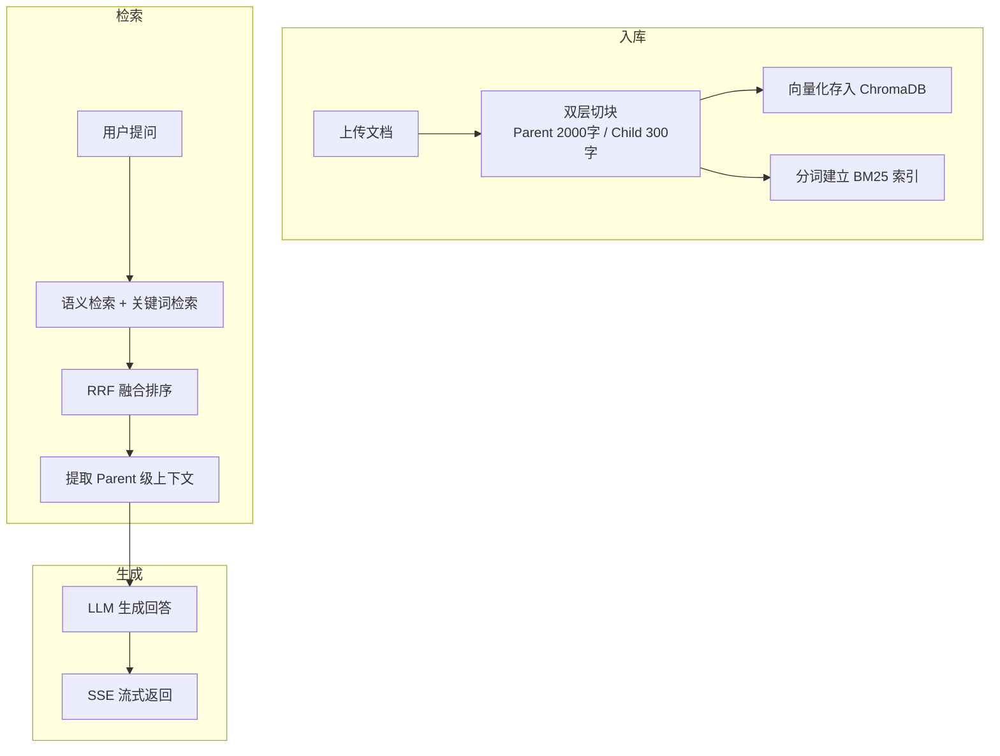
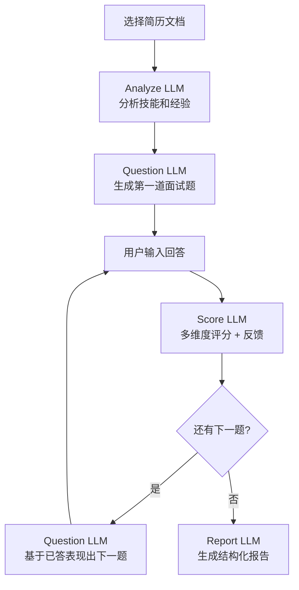

# 🎯 Interview Engine

基于 RAG 和 LLM 的求职辅助系统。上传简历和岗位描述，通过 Web 页面即可进行智能问答、AI 模拟面试、多维度评分和生成面试报告。

## 功能

**智能问答** — 上传文档后自然语言提问，RAG 检索相关内容，LLM 生成回答。

**模拟面试** — 选择简历，系统分析后逐题出题，你作答后给出评分和反馈。面试结束后自动生成报告，包含每题明细、维度分析、关键词命中率等。

**多维度评分** — 每题从技术深度、表达清晰度、逻辑性三个维度评分。

## 快速开始

```bash
# 1. 克隆
git clone https://github.com/your-username/interview-engine.git
cd interview-engine

# 2. 安装依赖
python -m venv .venv
.venv\Scripts\pip install -r requirements.txt

# 3. 配置 API Key
# 复制 .env.example 为 .env，填入你的 LLM_API_KEY
# 支持 DeepSeek / OpenAI 等兼容格式的 API

# 4. 启动服务
.venv\Scripts\python main.py
```

启动后浏览器打开 `http://127.0.0.1:8765` 即可使用。

> 首次启动会自动下载 embedding 模型（~95MB），请保持网络通畅。国内用户会自动使用镜像下载。

## 工作流程

### RAG 问答流程



### 面试流程



## 项目结构

```
interview-engine/
├── main.py              # FastAPI 应用入口
├── rag_engine.py        # RAG + BM25 混合检索
├── interview_agent.py   # 面试引擎（4 个 LLM 调用）
├── database.py          # SQLite 操作层
├── config.py            # 配置
├── pdf_handler.py       # PDF/DOCX 提取
├── schemas.py           # Pydantic 模型
├── eval_retrieval.py    # 检索评测脚本
└── templates/
    └── index.html       # 前端页面
```

## 技术栈

FastAPI / ChromaDB / sentence-transformers / rank-bm25 / SQLite
