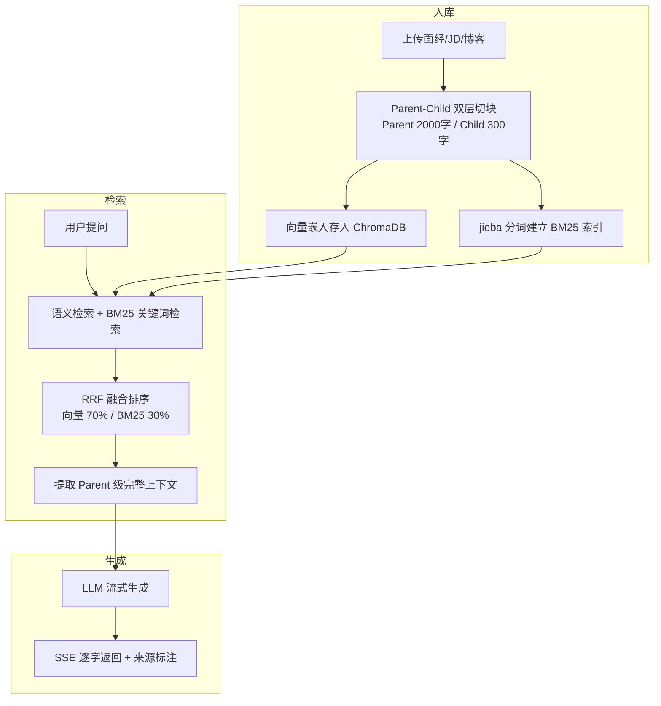
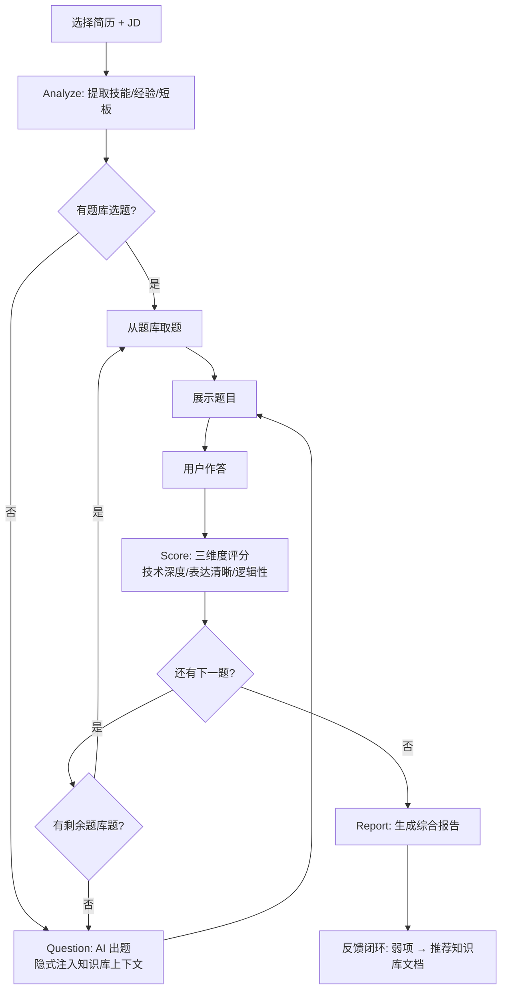

# 🎯 Offer Get

AI 面试备战教练 — 上传面经、JD、简历，RAG 智能研究 + 模拟面试 + 题库管理。

## 功能

**🎯 备战中心** — 上传面经、JD、技术博客构建知识库，一键分析目标公司面试趋势，生成备战建议。混合检索（向量 + BM25）+ SSE 流式输出。

**🎤 模拟面试** — 选简历开始面试，AI 自动参考知识库内容出题（隐式注入）。多维度评分（技术深度、表达、逻辑），反作弊检测，完成后生成详细报告 + 备战推荐。

**📝 题库管理** — 收藏面试好题，从题库启动面试。独立题库页面，卡片式展示。

**👤 用户系统** — 注册/登录，数据隔离。管理员面板可查看统计、管理用户。

## 系统流程

### RAG 备战引擎



### 模拟面试管线



## 快速开始

```bash
# 1. 安装依赖
pip install -r requirements.txt

# 2. 配置
cp .env.example .env
# 编辑 .env，必填 LLM_API_KEY 和 APP_SECRET_KEY

# 3. 启动
python main.py
```

浏览器打开 `http://127.0.0.1:8765`。

> 首次启动自动下载 embedding 模型（~95MB），国内自动走镜像。

## Docker 部署

```bash
cp .env.example .env
# 编辑 .env，填入 LLM_API_KEY 和 APP_SECRET_KEY

docker compose up -d
```

启动后访问 `http://服务器IP:8765`。管理面板在 `/admin`。

### 数据持久化

所有运行时数据统一挂载在 `./data`：

| 内容 | 路径 |
|------|------|
| 向量库 | `data/chroma_db/` |
| 数据库 | `data/interview_engine.db` |
| BM25 索引 | `data/bm25_index.json` |
| 模型缓存 | `data/hf_cache/` |

## 创建管理员

```bash
docker compose exec app python -c "
from database import create_user
import hashlib, os
def hp(p):
    s = os.urandom(16)
    d = hashlib.pbkdf2_hmac('sha256', p.encode(), s, 100000)
    return s.hex() + ':' + d.hex()
create_user('admin', hp('你的密码'), is_admin=1)
print('done')
"
```

## 项目结构

```
├── main.py              # FastAPI 应用（路由 + 认证 + 全部 API）
├── rag_engine.py        # RAG 引擎（Parent-Child 分块 + 混合检索 + RRF 融合）
├── interview_agent.py   # 面试引擎（分析→出题→评分→报告）
├── database.py          # SQLite 操作层（用户/文档/面试/题库）
├── config.py            # 环境配置
├── schemas.py           # Pydantic 模型
├── pdf_handler.py       # PDF/DOCX 提取（OCR 降级）
├── templates/
│   ├── index.html       # 用户端（备战 + 面试 + 题库）
│   └── admin.html       # 管理端
└── tests/               # 测试
```

## 技术栈

FastAPI / ChromaDB / sentence-transformers / rank-bm25 + jieba / SQLite / 零框架原生前端
